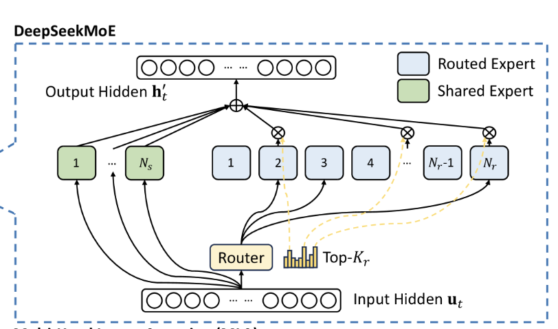

# 从零构建推理语言模型：一定算力预算下的deepseek-r1从零复现方案


> What I cannot create, I do not understand.
>
> —— Richard Feynman

## 写在前面

### 项目背景与目标

我的初衷是构建一个简洁而模块间相互独立的复现实现以及相关考虑，从而使学习大语言模型的过程中可以逐步的了解优化方向以及整个语言模型的制作过程，由此我选择采用上层封装好的架构来进一步加速动手到落地的过程，注重效益和时间，为快速入门语言模型训练作好理论基础和实践指南。

作为基础，我推荐学习这个github项目来给深究代码实现，对大语言模型入门缺少基本机器学习基础的初学者
[https://github.com/karpathy/nanochat]

此项目跟进了最新的语言模型进展，并实现了前沿的优化器和强化学习算法。
---

## 流程概览

<details>
<summary>点击展开查看完整流程</summary>

*   **模型架构 (Model Architecture)**
    *   注意力机制 (Attention)
    *   多 Token 预测解码 (Multi-Token Prediction)
    *   混合专家模型 (MoE)
    *   全局与交错注意力 (Global & Interleaved Attention)
    *   注意力池化 (Attention Pooling)
*   **分词器 (Tokenizer)**
    *   训练 (Training)
    *   泛化性 (Generalization)
*   **数据集处理 (Dataset Processing)**
    *   中英语料 (Chinese & English Corpora)
    *   推理语料 (Inference Corpora)
    *   冷启动语料 (Cold-Start Corpora)
*   **优化器 (Optimizer)**
    *   AdamW
    *   Muon
*   **参数选择 (Parameter Selection)**
    *   模型参数 (Model Parameters)
    *   训练参数 (Training Parameters)
*   **训练加速 (Training Acceleration)**
    *   混合精度训练 (Mixed-Precision Training)
    *   分布式训练 (Distributed Training)
    *   梯度累积 (Gradient Accumulation)
    *   梯度检查点 (Gradient Checkpointing)
    *   预计算 (Pre-computation)
*   **退火 (Annealing)**
*   **冷启动 (Cold Start)**
*   **强化学习 (Reinforcement Learning)**
    *   GRPO (Generalized Rejection Sampling Policy Optimization)
    *   DAPO (Direct Advantage Policy Optimization)
    *   GSPO (Grafted Supervised Policy Optimization)
*   **指令微调 (Instruction Tuning)**
    *   监督微调 (SFT, Supervised Fine-Tuning)
    *   直接偏好优化 (DPO, Direct Preference Optimization)
*   **性能评估 (Performance Evaluation)**
    *   `lm-eval`
*   **模型量化 (Model Quantization)**
    *   `llama.cpp`
*   **推理部署 (Inference & Deployment)**
    *   `vllm`
    *   `sglang`
    *   `ollama`

</details>

---

## (更新于 2025.10.28)

## 一、模型架构

### 1.1 注意力机制 (Attention Mechanism)

注意力机制（Attention Mechanism）自 Transformer 架构提出以来，特别是随着 ChatGPT-3.5 等模型的广泛应用，已成为现代主流大语言模型的核心构建模块。

从概念上讲，该机制借鉴了数据库的查询（Query）思想。当一个词元（Token）需要从其他词元中获取信息时，我们可以将上下文中的所有词元视为一个小型“数据库”。该词元作为“查询方”（Query），向数据库中的每个词元（作为 Key）发起查询，根据相关性（相似度）得到每个词元所携带信息（Value）的权重，最终将所有 Value 加权求和，完成一次高效的信息提取。

为此，我们将输入序列的隐藏层表示（Hidden States）线性投影成三种不同的向量：查询向量（Query, **Q**）、键向量（Key, **K**）和值向量（Value, **V**），并基于它们进行后续计算。


另一方面，我们从上面的计算公式中可以发现，qk相乘还需要除以隐藏层维度的开方，这是因为我们往往初始化q,k在零附近，而两者相乘后，其值域往往与隐藏层成正比，因此，我们需要归一化来避免softmax后的两级化。

##### 多头注意力
引入多头注意力的好处是，将原本庞大的注意力头分解为多个更小的注意力头，从而实现分工合作，提高信息提取的特异性和有效性，在机器可解释性的论文指出，注意力头有归纳推理头，用于上下文复现，也有语法，句法头等等，如果有兴趣可以自行探索。另一方面，当我们把目光放在如何配置模型参数上时，我们需要知道大概多少的注意力维度比较适合，一般来说，注意力维度至少要大于8.33log(N)，N为词向量长度，目前的大语言模型通常使用100k往上的词表预训练，因此96，128是一个常见的选择，这个数学下界在苏剑林老师的文章中有提到。[https://spaces.ac.cn/archives/8711](https://spaces.ac.cn/archives/7695)

自注意力机制不仅是一种强大的特征提取范式，其更核心的优势在于**天然的并行计算特性**。相较于循环神经网络（RNN）或传统卷积神经网络（CNN）等序列依赖模型，Transformer 架构允许在处理序列时一次性计算所有词元之间的关系，极大地提升了数据吞吐量和训练效率。可以说，是这种高效的并行能力，结合海量数据，共同推动了 Transformer 在语言建模任务上的巨大成功。

##### 分组注意力
分组注意力的最初愿景是在计算效率和模型性能之间取得一个比较好的平衡，我们可以这样考虑，当不同的注意力头进行键值查询的时候，能否通过共用同一词向量的数据库进行查询，只是查询的问题不同从而减少对key,value的需求呢，由此可见，分组注意力牺牲了一部分数据的表示而利用一个低秩的共享维度来获取计算效率的提高，因为这个共享的维度将在模型训练过程中共享数据将潜在学会将信息包含其中。

##### 潜在注意力
这种注意力形式，最初被deepseek提出，通过一个巧妙的矩阵转置，将key和value向量压缩到一个低维的投影向量中，通过低秩分解来进一步的推进kv缓存的减少。另外，一个很神奇的地方是在于通过这个实现，潜在注意力可以在推理过程中使用多头注意力的计算方式，而解码推理时却只采用类似分组注意力的方式，换句话说，MLA即有多头注意力的性能，也有分组注意力的解码效率，这是我认为很关键的一点。

##### 注意力池化 attn sink
2026年以来，对于模型上下文的需求大量提升，一方面推理语言模型的架构变革要求语言模型能够在长上下文中推理而保持稳定的性能，另一方面，肉眼可见的性能提升使模型的应用需求不断提高，因此近年来对于长上下文的研究也就成为了经济廉价的追求。

而注意力池化现象是指，语言模型在长上下文推理过程中，如果遇到某些没有把握的文本生成任务，语言模型会由于softmax机制强制将注意力完全分配到1，而分配到的大部分集中在开头的一部分无意义token中，论文中例证如果抛弃开头的部分token会导致语言模型推理迅速崩溃，这也是现在越来越多架构正在改进的一个关键点,参考论文[https://arxiv.org/abs/2309.17453]

##### 注意力门控 attn gate
注意力门控机制就是为了解决上述的问题所引进的一个改进，qwen3next中，引入了注意力门控，与gptoss不同，gptoss通过虚拟几个token放置在模型生成前，推理完毕后将其抛弃，而注意力门控则采取一个偏置值来控制注意力的流出，因此可以有效的减少attn sink现象的出现。
公式如下

$$
\tilde{A} = \mathrm{Softmax}\big( (QK^\top / \sqrt{d_k}) + b_g \big)
$$

##### 混合注意力 mix attn
基本上，后推理时代的模型架构转型往往需要长上下文对各类高难任务提供支撑，这就提出了对文本生成效率和指令遵循的要求，如果还采用全注意力，会因为O(n*2)的计算下极大的降低长文本生成速度，而采用线性注意力，则降低了对指令遵循的性能，因此混合注意力往往作为两者的结合来取得两者中间平衡的点。

#### **基于注意力的图像识别实现**
为了直观体验注意力机制的原理，我们提供了一个基于全注意力（Vision Transformer）实现手写数字识别的简单示例。

首先，克隆本项目的代码库：
```bash
git clone https://github.com/jinliuxi1024/from-zero-bulid-r1
```
进入项目目录并安装依赖：
```bash
cd from-zero-bulid-r1
pip install -r requirements.txt
```
运行示例代码：
```bash
python attn/tiny_vit.py
```

在这个案例中attn模块基本代替了传统的cnn卷积模块，模型的总体架构是按照数据->特征提取->非线性变换->输出的思路设计，并在几轮后快速收敛，我之所以给出这样的demo，是给出一个直观的全局视野作为整体的流程设计，我们此后的过程也与上面的基本框架一致。


### 1.2 前馈神经网络 (Feed-Forward Network)

前馈神经网络（FFN）层通常由多层感知机（MLP）构成，在注意力层之后进行非线性变换，旨在对注意力机制提取的特征信息进行深度整合与加工。

近期的研究表明，FFN 层在模型中扮演着至关重要的角色：**它被认为是模型存储和调用其在训练过程中学到的事实性知识（factual knowledge）的关键组件**。人类语言在本质上可能是简洁的，但由于信息不对称（即“噪音”）的存在，使其显得博大精深。知识本身可以被视为对外部世界不确定性的认知与归纳。

模型架构的演进也遵循着从简洁到复杂、再回归到某种“动态简洁”的规律。这引出了一个重要问题：语言建模是否必然需要一个庞大且处处激活的参数集？这正是混合专家模型（MoE）架构试图回答的问题，其核心思想在于，并非所有任务都需要动用模型的全部知识。

### 1.3 混合专家模型 (Mixture of Experts, MoE)

观察语言模型的发展历程，可以发现其架构从相对简洁的 Transformer 设计演变为更具工业化色彩的复杂结构，其中最具代表性的演进便是**混合专家模型（MoE）**的引入。



MoE 最初由 Google 等机构探索，其核心目标是在保持甚至提升模型性能的同时，大幅降低推理时的计算成本。这一架构随后被 Mistral AI (`Mixtral`) 和 DeepSeek (`DeepSeek-MoE`) 等公司发扬光大，并迅速成为当前顶尖大模型的主流设计之一。

其核心思想是：将一个庞大的前馈网络（FFN）层替换为多个小型的“专家”网络（Experts）和一个“路由器”（Router）。在处理每个输入词元时，路由器会动态地、有选择性地激活一小部分（通常是 1-2 个）专家来参与计算，而其他专家则保持休眠。

这种**稀疏激活（Sparse Activation）**的特性带来了显著的经济性。然而，对于参数规模相对较小的模型，我们应如何考量 MoE 的应用呢？

结论是肯定的。尽管 MoE 模型的性能无法完全等同于一个参数量为其**总参数量**的密集模型（Dense Model），但其实际性能通常远超一个参数量与其**激活参数量**相等的密集模型。它通过在巨大的参数空间中进行稀疏选择，实现了性能与计算效率之间的卓越平衡。

打磨考量:事实上，deepseek主张细颗粒度的专家度划分，具体的实现来说就是主张划分更多的小专家，但是在开发小语言模型时，我们需要注意过小的专家表达能力有限，所以我们往往在设计时考虑hidden_size不要过小，保持适当的表达能力。

#### 1.3.1 共享专家架构
在deepseekv2中，论文认为，语言建模的部分知识是可以共享的，对于专家分工的考虑上，应当实现精细化的设置，即几个共享专家，和庞大的路由专家公共协作完成任务，这与我们的直觉一致，回答特定问题的一些知识是类似的，比如，当我们回答语言模型或者视觉模型的架构时，我们总体对神经网络的建模知识总是作为共享的部分参与回答的组成，降级来说，即使我们回答今天吃什么或者你好本身来说，两者不相关的问题也存在句法或者词法的基本知识，使我们的回答可以被对方理解。

#### 1.4 分词处理 tokenize
语言模型的输入部分往往不是我们平常看到的单词或者句子，为了计算方便，在计算机上往往映射成某个数字，比如
```bash
   INPUT 你好，介绍一下你自己
   OUPUT 532 , 21 , 474 , 12345 , 789 , 5476
```
将所有的文本按映射规则映射成数字，类似数据结构中的页表一样，语言模型需要一个词表来存储这样的映射关系表，我们称之为词表
处理过程称为 tokenize

可以这样测试一下deepseek-r1的分词器
```bash
from transformers import AutoTokenizer

# 从Hugging Face Hub加载分词器
# 指定模型，例如 "deepseek-ai/DeepSeek-R1"
tokenizer = AutoTokenizer.from_pretrained("deepseek-ai/DeepSeek-R1", trust_remote_code=True)

# 待分词的句子
sentence = "你好，介绍一下你自己"

# 进行分词
tokens = tokenizer.tokenize(sentence)
token_ids = tokenizer.encode(sentence)

# 打印结果
print(f"原始句子: {sentence}")
print(f"分词结果 (Tokens): {tokens}")
print(f"分词结果 (Token IDs): {token_ids}")
```
### 1.5 多token预测解码 Mtp
什么是多token预测解码呢，这个工作最初是由meta提出，作为模型的训练的附加正则化，有效提高模型性能的组件而构建。具体参考[https://arxiv.org/abs/2404.19737]这篇论文。

基本思路是，在模型最后输出的语言头后追加一层transformerslayer，此层接受输出的logits并作下下一个token的预测，通过一定的权重来计算这一部分的交叉熵损失，因此在训练过程中，模型就会不仅关注下一个token的预测，也会关注下下个token的预测，使得模型具有较远的视野。
但是论文提出过小的模型实现这个模块会降低模型性能，一方面是因为数据噪声的影响，另一方面计算交叉熵损失在小层数语言模型上是计算限制端的，平白无故的增加此模块如同鸡肋。

## 二、分词器

### 2.1 分词算法 bge
在o(n)的计算复杂度的情况下一次遍历就可以得到该序列的分词数组是一个技术性问题，在自然语言处理的初级阶段，人们往往是采用有限自动机或者使用句法树来完成这一任务的，后来的发展过程中，采用启发式合并的bge算法成为构建gpt系列模型的一部分实现。

### 2.2 分词器词表大小
在设计小型语言模型时，我们应当考虑分词器的词表大小，即不能头重脚轻，也不能一味的缩小词表而使强化学习的训练深度增加而徒增强化学习的难度。作为借鉴，在训练早期的时候选取大公司训练的分词器是一个很好的选择，而在进一步裁剪非重要结构时，我们可以适当缩小词表而追求仅在推理语料上训练此分词器。作为推荐，我们一般选取65536的大小词表作为一个100M大小前后的模型分词器。如果采用较小的词表如6400，那么模型在强化学习方面，在预训练时就不能保持一个合理的长度，即使只有1024的上下文，恐怕都难以覆盖大部分短语料，然而选取大公司的词表则会导致模型分词维度的浪费，白白的浪费宝贵的算力。

### 2.3 分词器训练
作为简明起见，我们选取huggingface集成的分词器训练代码，并在我们的预训练语料中进行训练，值得注意的是，分词器的训练是内存bound的，因此，我们如果拥有很多的内存时，可以将更多的语料读入到内存中，进一步增加其泛化性。

在训练时，我们可以提前读取预训练的语料并作一部分的采样，这样实现分词效率在训练语料上尽可能泛化，提高训练效率。

## 三、数据集处理

### 3.1 中英文语料
中英文的语料配比是一件相对麻烦的事，在训练双语模型时，由于使用的分词器不同，对中英文语料的划分后产生的token数量不同，比如，使用deepseek分词器时，我们可能发现差不多长度的英文语料往往比中文语料分词后token数量要少。
[https://huggingface.co/datasets/openbmb/Ultra-FineWeb]
在此，我选取了既有中文语料也有英文语料的数据集，在训练100M的语言模型时，我们大致需要选取了两者各自八个数据集检查点。

### 3.2 推理语料
deepseek论文中提出蒸馏模型比纯强化学习的语言模型在小模型上更有效，目前在众多的推理语言模型层出不穷的情况下，推理模型的蒸馏语料已经在模型退火阶段和中期训练阶段中得到大量应用。

https://huggingface.co/datasets/Mxode/Chinese-Reasoning-Distil-Data

https://huggingface.co/datasets/andyrdt/gpt-oss-20b-rollouts

以上是选取的推理语料，事实上中文语料开源数据还较少。

### 3.3 语料预处理设计
当我们训练推理模型时，由于其经济性的原因，我们往往会选择较小的上下文长度，然而，这样的预训练长度对长推理的性能有损害，模型没能泛化通用的思维模式而间接导致强化学习失败都是得不偿失的。

为此我们通常根据目前推理语料的平均长度来作为一个初步估计，选择4096的初始上下文长度较为合适，这一方面是工业上的考量，因为目前的开源模型的原始上下文长度在早期训练的时候往往是4096，而后利用rope等上下文拓展策略来实现长度泛化。

当我们训练模型时，语料的长度必然不能自由控制，因此填充技术和截断技术是提高训练效率的关键，我们往往会将不同的语料拼接成一段长上下文，填充到4096长度，而后截断来作为训练材料。

但是，盲目的混合材料是不恰当的，一般来说我们会选择在语料的开头添加<bos>的标签作为说明，而在语料的结尾添加<eos>作为结束的标记，这样一来，在广阔的截断可能中，模型会学会在<bos>后自然的开始一段与前文无关的文本，这样的一种训练方式，有利于后续微调过程中提高模型的指令遵循能力，同时也减少模型拟合泛化语料的难度。

#### 3.3.1 训练的数据量与参数之间的关系
参考文献
https://arxiv.org/abs/2203.15556

一般来说，我们采取Chinchilla原则来估计模型充分训练所需的数据量，事实上，我们以token作为单位来计算数据量，在Chinchilla原则中，指出模型训练所需的数据基本与模型的参数成20k倍的关系。举个例子，在本项目中，我们会训练一个200M大小的语言模型，那么我们就需要大约4GB的token。

## 四、优化器
### 4.1 AdamW
AdamW是在目前大语言模型训练中广泛采用的训练优化器，它在Transformer、BERT、GPT等模型的训练中被广泛使用，是当前主流的大模型训练默认选择。然而，尽管AdamW通过解耦权重衰减有效提升了优化稳定性与泛化能力，其本质仍依赖于一阶梯度信息进行参数更新，在面对复杂推理任务或高噪声奖励信号时，往往难以刻画策略空间中的精细结构；同时，其固定形式的更新规则缺乏对任务结构与反馈信号的自适应能力，这在强化学习或长链推理场景中尤为明显，可能导致收敛效率受限甚至陷入次优解。因此，在大模型尤其是推理导向模型的训练过程中，探索更具结构感知能力与动态调整机制的优化方法，成为进一步提升性能的关键方向。

### 4.2 Muon
Muon 是近年来提出的一类面向大规模模型训练的优化方法，旨在突破传统一阶优化器（如 AdamW）在效率与泛化上的瓶颈。其核心思想在于引入对参数更新方向的结构化约束与归一化处理，使得优化过程不仅依赖梯度大小，还能够在一定程度上感知参数空间的几何性质，从而实现更加稳定且高效的收敛。在一些大模型训练实践中，Muon 被观察到可以在保持甚至降低计算开销的同时，提高训练稳定性，并在长序列建模或高维参数空间中展现出更好的扩展性。


